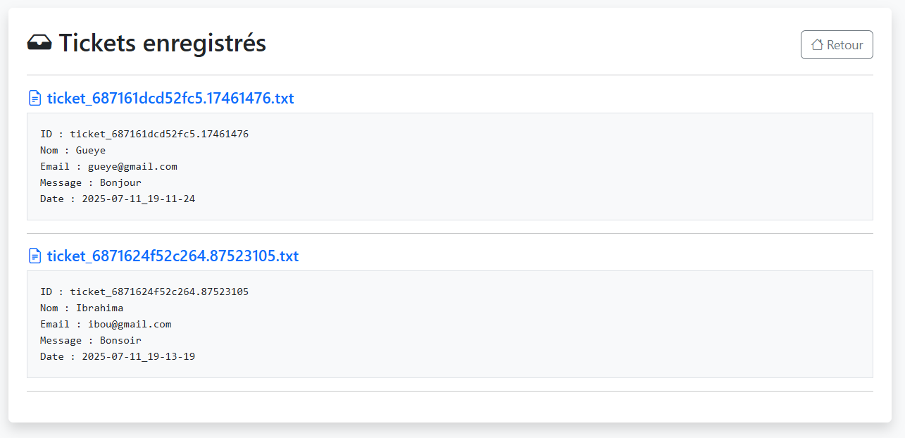
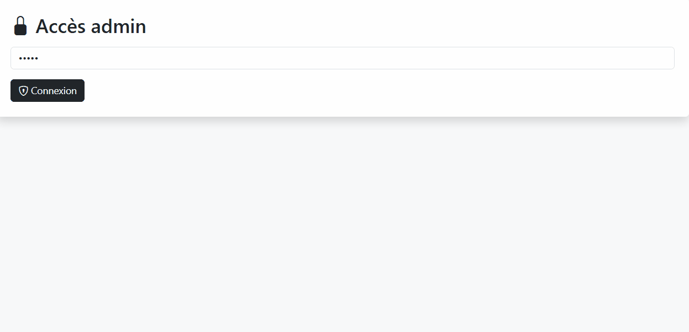

# 📮 Projet 05 – Formulaire de support ticket

### 📝 Description :
Application PHP avec un formulaire public permettant de soumettre un ticket. Chaque ticket est sauvegardé dans un fichier `.txt` avec ID et horodatage. L'interface admin protégée permet de consulter tous les tickets.

### 🖼️ Image :

### 🎞️ GIF démonstration :

### 🎥 Vidéo (sans son) :
📽️ [Voir la vidéo](https://drive.google.com/file/d/1jEDPUWxJHcCcn9lba-9kVHGQgXVyzm_Z/view?usp=sharing)

### 🔗 Lien GitHub :
[https://github.com/tbyb/support-ticket-php](https://github.com/tbyb/support-ticket-php)

### 🛠️ Technologies utilisées :
- PHP
- HTML/CSS + Bootstrap
- Fichiers `.txt` + horodatage
